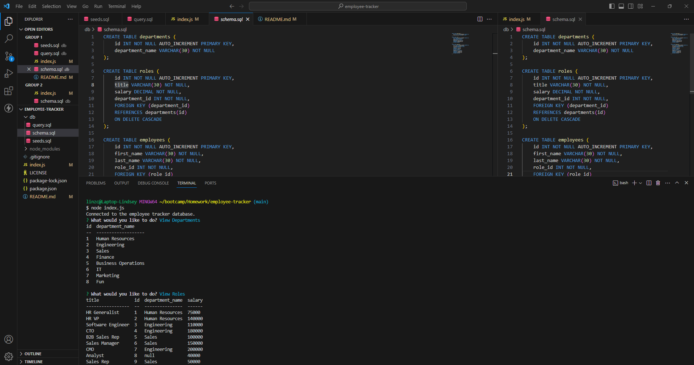

  # Employee Tracker Database 
  
  ## Description
  
  This project is an Employee Tracker Database that enables a business owner to view, create, and modify employee data using the command line. I used inquirer for the prompts and mysql for the database. With my HR background, this project gave me a behind-the-scenes look at how employee databases function.
  
  ## Table of Contents
  
  * [Installation](#installation)
  * [Usage](#usage)
  * [License](#license)
  * [Contribution Guidelines](#contributions)
  * [Questions](#questions)
  
  ## Installation
  
  This is a command-line application. As such, it requires Node.js, inquirer, mysql, and a program such as vscode in order to run it.
  
  ## Usage
  
  1. Open the index.js file in the integrated terminal. 
  2. Use the arrow keys to choose what you would like to do. 
  3. Press enter. 
  4. Follow the additional prompts. 
  5. Select another option or Quit to leave the program.

  

  *Video walkthrough: https://watch.screencastify.com/v/ljoFqLjzLc0JjiPVBGHN
  
  ## License
    
  This project uses the MIT license
    
  
  ## Contributions
  
  N/A
  
  ## Questions
  This project was created by [lindseycarlson23](https://github.com/lindseycarlson23)
  Send me an email here: lindseycarlson23@gmail.com
  